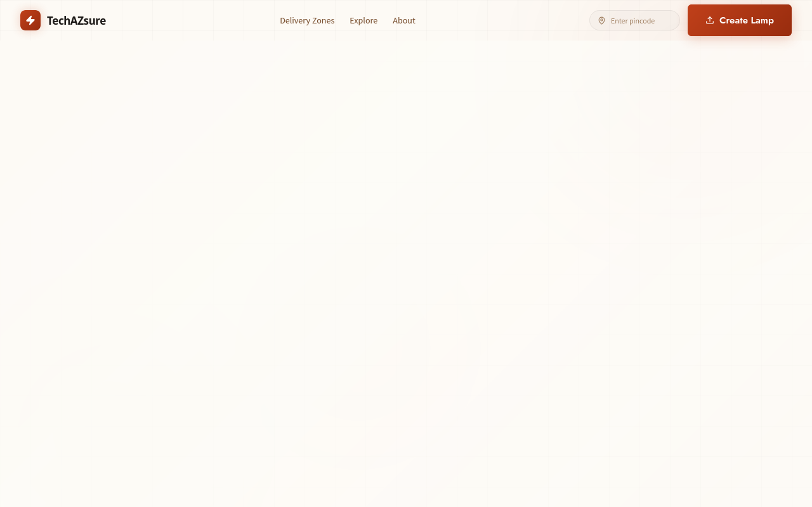
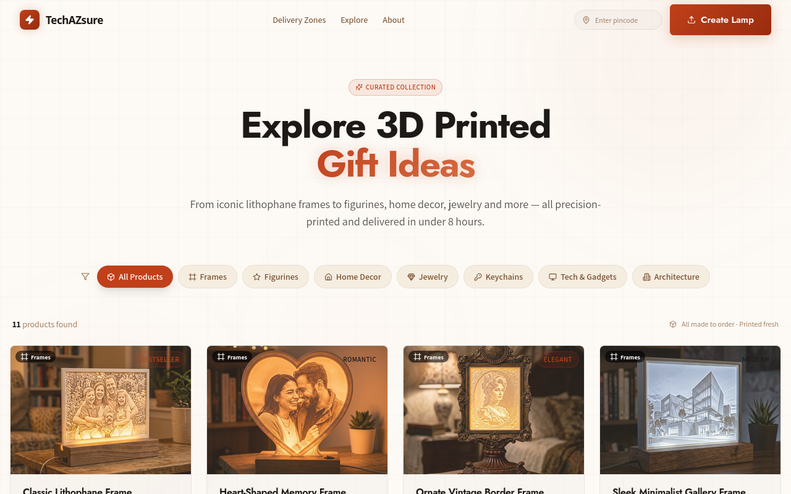
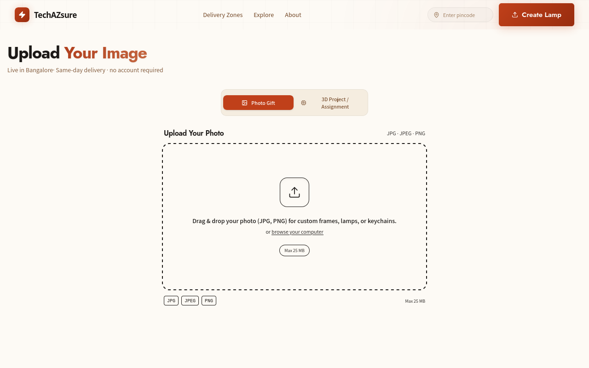
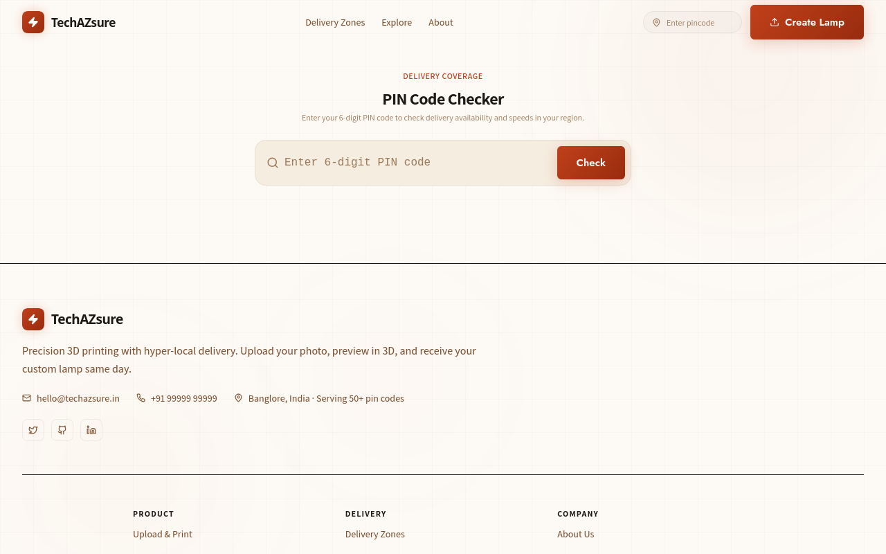
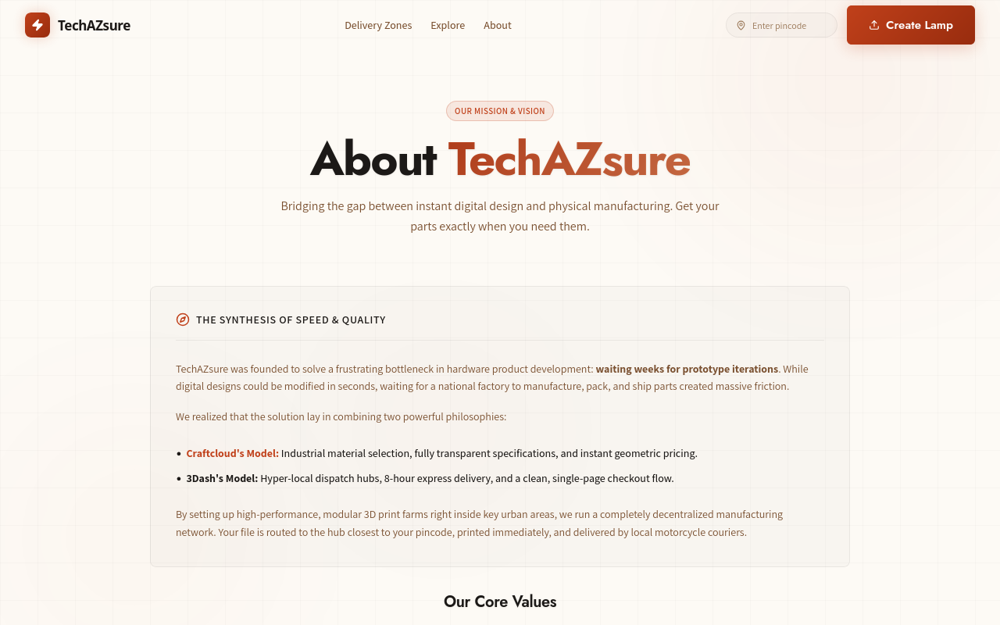

# 3D Print Ecommerce

A Next.js storefront for turning your photos into custom 3D-printed lithophane lamps. Pick a frame style, upload a photo, choose material and delivery speed, and check out — the design is rendered in 3D in your browser before you commit.

This repository contains the full frontend of the platform. The backend (orders, payments, file storage) is a separate service that this app talks to over HTTP.

---

## Screenshots

All screenshots are real renders captured against the running dev server.

**Home page**


**Explore — sample products and frame styles**


**Upload flow — pick a frame, drop a photo, preview in 3D**


**Service zones — where we ship**


**About**


---

## What is a lithophane lamp, briefly

A lithophane is a thin translucent panel carved with a grayscale image. When you place an LED light behind it, the varying thickness of the material projects the photo as a glowing image. This site lets a customer upload any photo, frame it in one of several decorative styles, and order a 3D-printed version with a USB-powered warm LED base included.

---

## Features

- Hero with auto-rotating slideshow background and glassmorphism CTA panel
- Product catalog across six categories: figurines, home decor, jewelry, tech accessories, keychains, architecture miniatures
- Decorative frame options: classic, minimal, vintage, heart, celebration
- Interactive STL uploader with live 3D preview using react-three-fiber
- Order flow: pick size tier, material (PLA / PETG / ABS / Resin), delivery speed
- Live price summary in the side panel as the customer configures their order
- Service zone map (India-focused) showing delivery coverage
- Themeable design system with 20 pre-configured look-and-feel combos
- Fully responsive (mobile / tablet / desktop), with separate mobile and desktop hero layouts for performance
- App Router with file-based routing, server and client components mixed appropriately

---

## Tech stack

| Layer | Choice |
|-------|--------|
| Framework | Next.js 16.2.9 (App Router, webpack mode) |
| UI | React 19, TypeScript 5 |
| Styling | Tailwind CSS 4, custom design tokens, glassmorphism utilities |
| 3D rendering | three.js, @react-three/fiber, @react-three/drei |
| Animation | framer-motion |
| State | zustand |
| Icons | lucide-react |
| Linting | ESLint 9 with eslint-config-next |

---

## Project structure

```
3d_print_ecommerce/
|-- frontend/                      The Next.js application (everything lives here)
|   |-- app/                       App Router pages
|   |   |-- page.tsx               Home page
|   |   |-- explore/               Product catalog
|   |   |-- upload/                Order flow entry (frame picker, photo uploader, 3D preview)
|   |   |-- zones/                 Service zones
|   |   |-- about/                 About page
|   |   |-- layout.tsx             Root layout (header, footer, global wrapper)
|   |   `-- globals.css            Tailwind imports + design tokens
|   |
|   |-- components/
|   |   |-- layout/                Header, Footer
|   |   |-- order-flow/            UploadZone, MaterialSelect, DeliveryTiers, PriceSummary
|   |   `-- viewer/                ModelViewer (three.js canvas wrapper)
|   |
|   |-- config/
|   |   |-- siteContent.ts         Single source of truth for all copy, pricing, assets
|   |   `-- themes.ts              20 pre-configured theme combos
|   |
|   |-- store/
|   |   `-- useOrderStore.ts       zustand store for the order flow state
|   |
|   |-- public/                    Static assets
|   |   |-- models/                Product thumbnails (PNG)
|   |   |-- frames/                Frame style previews (PNG)
|   |   |-- slides/                Hero slider images (PNG)
|   |   |-- screenshots/           Real renders of the running app (PNG)
|   |   `-- placeholder.stl        Fallback STL when the user has not uploaded one
|   |
|   |-- package.json
|   |-- tsconfig.json
|   |-- next.config.ts
|   |-- tailwind config (PostCSS)
|   `-- react-three-fiber.d.ts
|
|-- Agent.md                       Project notes for AI agents
|-- hierarchy.md                   Original feature hierarchy
|-- install.md                     Setup guide for collaborators
`-- .gitignore
```

---

## Getting started

See `install.md` for the full walkthrough. The short version:

```bash
git clone https://github.com/gytdrop/3d_print_ecommerce.git
cd 3d_print_ecommerce/frontend
npm install
npm run dev
```

Then open http://localhost:3000.

---

## Available scripts

Run from inside `frontend/`:

| Command | What it does |
|---------|--------------|
| `npm run dev` | Starts the dev server at http://localhost:3000 with hot-reload |
| `npm run build` | Builds the production bundle into `.next/` |
| `npm start` | Runs the production build (run `build` first) |
| `npm run lint` | Runs ESLint |

---

## Configuration

All copy, pricing, hero slider images, and the active theme are defined in `frontend/config/siteContent.ts`. To switch the look-and-feel without touching any component code, edit `themeControl.selectedCombo` to one of:

- Warm and cozy: `cozy-moments`, `golden-warmth`, `honey-oak`, `nordic-cozy`
- Elegant and classic: `timeless-glow`, `blush-poetry`, `velvet-dusk`, `amber-journal`, `rose-library`
- Playful and happy: `sweet-celebration`, `cloudberry`, `mint-nostalgia`, `spice-market`, `marigold-festival`
- Organic and earthy: `garden-gift`, `morning-linen`, `soft-terracotta`, `sage-ritual`, `lavender-letter`, `desert-sun` (default)

---

## Browser support

The 3D viewer uses WebGL, so the upload page requires a WebGL-capable browser:

- Chrome / Edge 90 or newer
- Firefox 88 or newer
- Safari 15 or newer

The rest of the site degrades gracefully on older browsers — the uploader falls back to a static placeholder preview.

---

## Contributing

1. Fork the repo and create a feature branch
2. Make your changes
3. Run `npm run lint` and `npm run build` before opening a PR
4. Open a pull request with a clear description of what changed and why

Please do not commit `node_modules/`, `.next/`, `.env`, or anything listed in `.gitignore`.

---

## Roadmap

- Backend integration for actual order placement and payment
- User accounts and order history
- Email notifications with shipment tracking
- More frame styles and material options
- Internationalization (currently English only)
- AR preview of the lamp in the customer's room using WebXR

---

## License

Private — internal project. Do not redistribute without permission.
